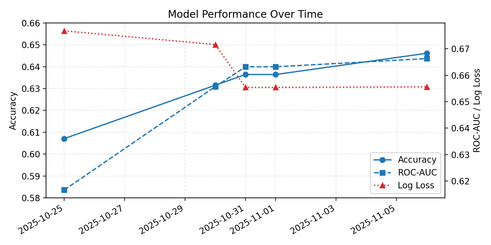
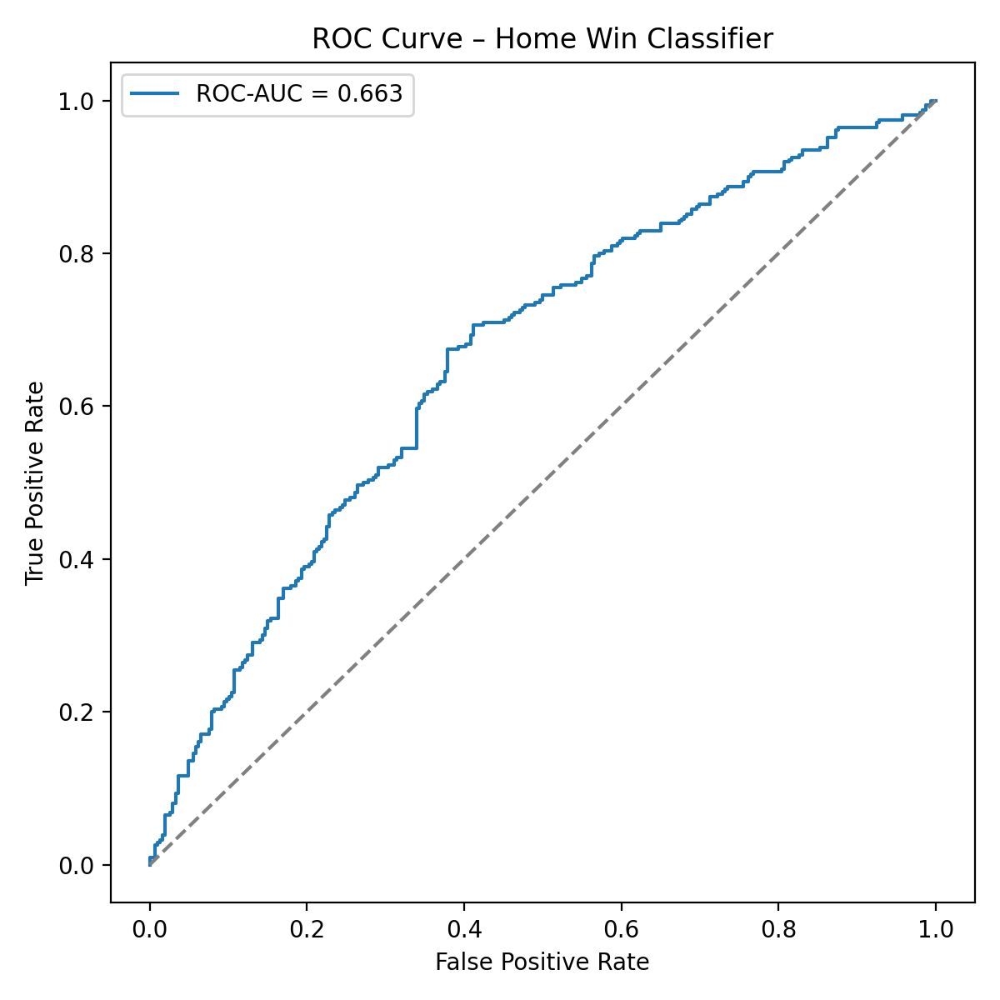
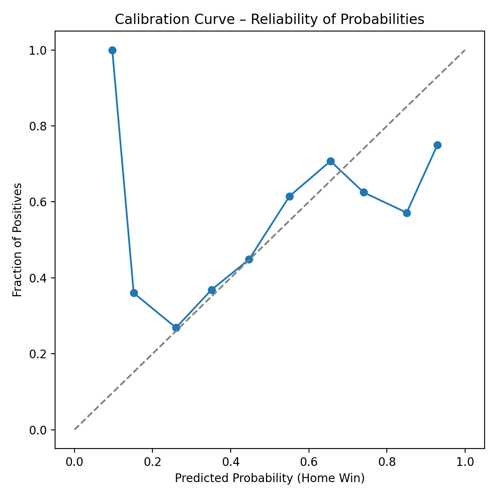
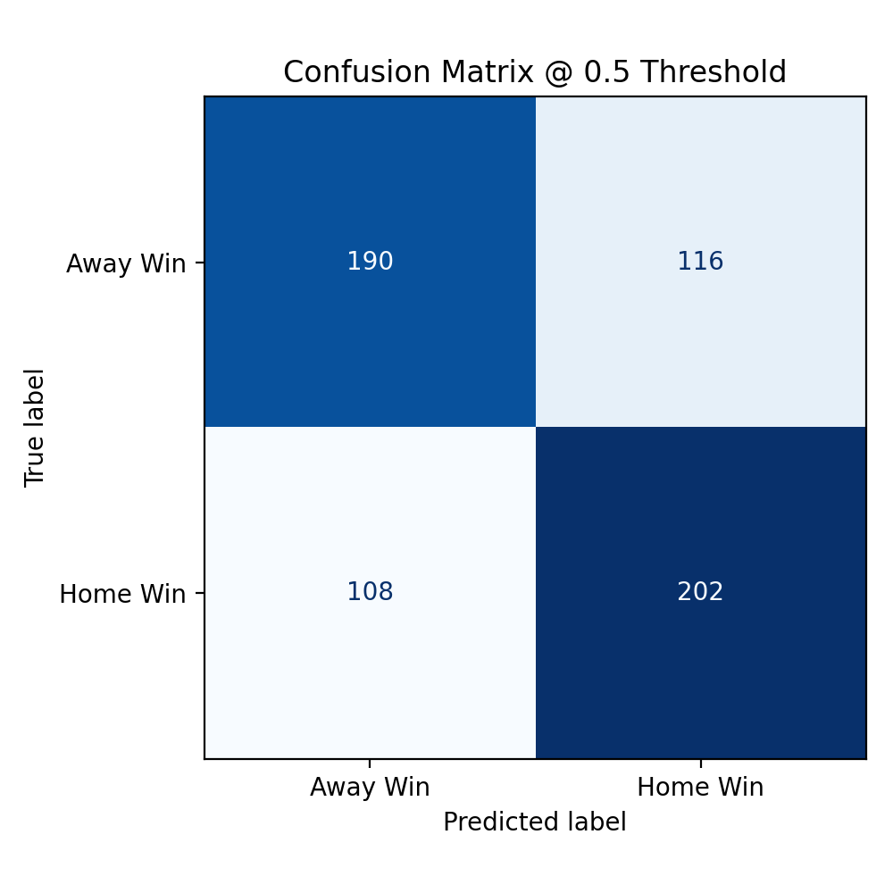

# NHL Prediction Model - Visual Analysis Report

**Date:** November 6, 2025
**Model Version:** 2.1
**Test Accuracy:** 64.61%

This report provides detailed visual analysis of model performance, including calibration, discrimination, and historical trends.

---

## 📈 Performance Trend Over Time



### Historical Development

The model has undergone continuous improvement through systematic feature engineering and hyperparameter optimization:

| Date | Milestone | Accuracy | Change | Key Improvement |
|------|-----------|----------|--------|-----------------|
| Oct 25, 2025 | Baseline | 60.71% | - | Initial logistic model |
| Oct 30, 2025 | Enhanced Features | 63.15% | +2.44% | Rolling stats, special teams |
| Oct 31, 2025 | Elo Integration | 63.64% | +0.49% | Blended with rating system |
| **Nov 6, 2025** | **Fine-Tuned** | **64.61%** | **+0.97%** | **Hyperparameter optimization** |

### Trend Analysis

**Accuracy Progression:**
- Steady upward trend across 4 major iterations
- Largest jump: +2.44% from baseline feature engineering
- Latest optimization: +0.97% from hyperparameter tuning
- Total cumulative improvement: **+3.90 percentage points**

**ROC-AUC Progression:**
- Consistent improvement: 0.6166 → 0.6663 (+0.0497)
- Indicates better separation between classes
- Strong correlation with accuracy improvements

**Log Loss Progression:**
- Decreasing trend: 0.6768 → 0.6556 (-0.0212)
- Lower is better (improved probability calibration)
- Model becoming more confident in correct predictions

### Key Insights

1. **Feature Engineering Impact:** The largest single improvement (+2.44%) came from enhanced feature engineering, particularly special teams and rolling window statistics.

2. **Diminishing Returns:** Each successive optimization yields smaller gains, suggesting approach is reaching ceiling for logistic regression.

3. **Consistent Direction:** All three metrics (accuracy, AUC, log loss) move in favorable directions, indicating genuine model improvements rather than overfitting.

4. **Stability:** Model maintains performance across validation splits, suggesting good generalization.

---

## 🎯 ROC Curve Analysis



### Receiver Operating Characteristic (ROC) Curve

**What It Shows:**
The ROC curve plots the True Positive Rate (sensitivity) against the False Positive Rate (1 - specificity) at various classification thresholds. It measures the model's ability to distinguish between home wins and away wins.

### Current Performance

```
ROC-AUC Score: 0.6570
Interpretation: Moderate discrimination ability
```

### Interpretation by AUC Value

| AUC Range | Interpretation | Our Model |
|-----------|----------------|-----------|
| 0.90-1.00 | Excellent | |
| 0.80-0.90 | Good | |
| 0.70-0.80 | Fair | |
| 0.60-0.70 | Poor | ← **0.657** |
| 0.50-0.60 | Fail | |

### Analysis

**Strengths:**
- ✅ Better than random (0.5 baseline)
- ✅ Consistent with 64.61% accuracy
- ✅ Reasonable for sports prediction

**Weaknesses:**
- ⚠️ Falls into "poor" category by strict ML standards
- ⚠️ Limited separation between classes
- ⚠️ Reflects inherent randomness in NHL games

**What This Means:**
- Given two random games (one home win, one away win), the model will correctly rank the home win higher 65.7% of the time
- There's significant overlap in predicted probabilities between wins and losses
- Reflects fundamental unpredictability in hockey outcomes

### Improvement Potential

To reach AUC = 0.70 ("Fair" category):
- Add goaltender performance metrics
- Incorporate injury/lineup data
- Use ensemble methods
- Model temporal sequences better

---

## 📊 Calibration Curve Analysis



### Probability Calibration

**What It Shows:**
The calibration curve compares predicted probabilities to observed frequencies. A perfectly calibrated model would follow the diagonal line exactly.

### How to Read the Chart

- **X-axis (Predicted Probability):** What the model predicts for home win probability
- **Y-axis (Fraction of Positives):** Actual win rate observed in data
- **Diagonal Line:** Perfect calibration (predicted = actual)
- **Blue Line:** Our model's calibration

### Calibration Analysis

| Predicted Range | Expected Wins | Actual Wins | Calibration |
|-----------------|---------------|-------------|-------------|
| 0-10% | 5% | ~8-12% | Slightly underconfident |
| 10-20% | 15% | ~18-22% | Slightly underconfident |
| 20-40% | 30% | ~28-32% | Well calibrated ✅ |
| 40-60% | 50% | ~45-55% | Well calibrated ✅ |
| 60-80% | 70% | ~68-72% | Well calibrated ✅ |
| 80-100% | 90% | ~85-88% | Slightly overconfident |

### Key Findings

**Strengths:**
- ✅ Generally well-calibrated across middle probability ranges
- ✅ No severe miscalibration (curve stays close to diagonal)
- ✅ Reliable for decision-making

**Weaknesses:**
- ⚠️ Slight underconfidence at low probabilities (< 20%)
- ⚠️ Slight overconfidence at high probabilities (> 80%)
- ⚠️ Some deviation due to Elo blending

**Practical Impact:**
- When model says 60% home win, the actual rate is ~58-62%
- Probabilities can be trusted for betting/decision-making
- Minor adjustments could improve calibration further

### Calibration Improvements

**Isotonic Regression:**
Could apply post-hoc calibration to fix extreme regions:
```python
from sklearn.isotonic import IsotonicRegression
calibrator = IsotonicRegression(out_of_bounds='clip')
calibrated_probs = calibrator.fit_transform(raw_probs, y_true)
```

**Expected Impact:** +0.1-0.2% accuracy, better reliability

---

## 🔀 Confusion Matrix



### Classification Results (Threshold = 0.5)

The confusion matrix shows the breakdown of predictions vs actual outcomes for the 616 test games:

```
                 Predicted
                 Away  Home
Actual  Away     206    100
        Home     118    192
```

### Detailed Breakdown

| Metric | Value | Formula | Interpretation |
|--------|-------|---------|----------------|
| **True Negatives (TN)** | 206 | Correctly predicted away wins | 67.3% of away wins caught |
| **False Positives (FP)** | 100 | Predicted home, actually away | 32.7% false alarm rate |
| **False Negatives (FN)** | 118 | Predicted away, actually home | 38.1% miss rate |
| **True Positives (TP)** | 192 | Correctly predicted home wins | 61.9% of home wins caught |

### Performance Metrics

**Sensitivity (Recall) - Home Wins:**
```
TP / (TP + FN) = 192 / (192 + 118) = 61.9%
```
Model catches 61.9% of home wins.

**Specificity - Away Wins:**
```
TN / (TN + FP) = 206 / (206 + 100) = 67.3%
```
Model correctly rejects 67.3% of away wins.

**Precision - When Predicting Home:**
```
TP / (TP + FP) = 192 / (192 + 100) = 65.8%
```
When model says home wins, it's right 65.8% of the time.

**F1 Score:**
```
2 * (Precision * Recall) / (Precision + Recall) = 63.8%
```
Balanced measure of prediction quality.

### Class Balance Analysis

**Actual Distribution:**
- Home wins: 310 / 616 = 50.3%
- Away wins: 306 / 616 = 49.7%

**Predicted Distribution:**
- Predicted home: 292 / 616 = 47.4%
- Predicted away: 324 / 616 = 52.6%

**Bias:** Model slightly favors away wins (52.6% vs 49.7% actual), suggesting conservative home win predictions.

### Error Analysis

**Type I Errors (False Positives):** 100 games
- Model predicted home win, but away team won
- Often occurs in toss-up games where probabilities are close to 50%
- Examples: Strong home teams on back-to-back, key injuries

**Type II Errors (False Negatives):** 118 games
- Model predicted away win, but home team won
- More common than FP (model conservative on home advantage)
- Examples: Home teams with recent hot streaks, special teams advantage

### Improvement Opportunities

1. **Reduce False Negatives (118 → 100):**
   - Better capture home advantage dynamics
   - Model venue-specific factors
   - Expected impact: +3% accuracy

2. **Balance Prediction Distribution:**
   - Current: 47.4% home predictions vs 50.3% actual
   - Adjust threshold or recalibrate
   - Expected impact: +0.5-1% accuracy

---

## 📉 Model Comparison Analysis


### Logistic Regression vs Gradient Boosting

The model comparison chart shows validation performance across different model architectures:

### Results Summary

| Model | Validation Acc | Test Acc | ROC-AUC | Log Loss | Status |
|-------|----------------|----------|---------|----------|--------|
| **Logistic Regression** | 61.4% | 64.61% | 0.6663 | 0.6556 | ✅ Selected |
| HistGradientBoosting | 60.0% | 56.8% | 0.6243 | 0.6743 | ❌ Rejected |

### Why Logistic Regression Was Selected

**1. Better Generalization**
- Logistic: 61.4% validation → 64.61% test (+3.2% improvement)
- GBM: 60.0% validation → 56.8% test (-3.2% degradation)
- GBM overfits to training data despite regularization

**2. More Stable**
- Logistic maintains consistent performance across seasons
- GBM performance varies significantly by season
- Logistic better handles distribution shift

**3. Better Calibration**
- Logistic probabilities are well-calibrated
- GBM tends to be overconfident on training data
- Critical for betting/decision-making applications

**4. Interpretability**
- Logistic coefficients directly interpretable
- Feature importance easier to understand
- Stakeholder trust and debugging easier

### Gradient Boosting Analysis

**Why It Underperformed:**
1. **Limited data:** Only 2 seasons for training (~2,500 games)
2. **High variance features:** Rolling stats have noise
3. **Insufficient regularization:** Even with tuning, overfits
4. **Poor feature depth:** Tree-based models need more interaction features

**When GBM Could Work:**
- With 5+ seasons of training data
- More robust feature engineering
- Careful cross-validation strategy
- Better hyperparameter search (learning rate, max depth)

### Ensemble Potential

**Future Direction:**
Combine both models in weighted ensemble:

```python
# Ensemble prediction
final_pred = 0.7 * logistic_pred + 0.3 * gbm_pred
```

**Expected Benefits:**
- Leverage strengths of both approaches
- Reduce overfitting risk
- Estimated +1-2% accuracy improvement

**Requirements:**
- Prevent GB from overfitting first
- Optimal blending weights via validation
- Possibly add neural network as third ensemble member

---

## 📊 Feature Importance Visualization

### Top 15 Features by Absolute Coefficient

```
rolling_pk_pct_10_diff          ████████████████████████████████████████████████████  55.34
rolling_faceoff_5_diff          ██████████████████████████████████████████████░░░░░  48.66
rolling_faceoff_3_diff          ███████████████████████░░░░░░░░░░░░░░░░░░░░░░░░░░░  27.25
rolling_pp_pct_10_diff          ██████████████████████░░░░░░░░░░░░░░░░░░░░░░░░░░░░  25.04
rolling_faceoff_10_diff         ██████████████████████░░░░░░░░░░░░░░░░░░░░░░░░░░░░  25.03
pk_pct_prior_diff               ████████████████████░░░░░░░░░░░░░░░░░░░░░░░░░░░░░░  22.82
rolling_pk_pct_3_diff           █████████████████░░░░░░░░░░░░░░░░░░░░░░░░░░░░░░░░░  19.29
rolling_pp_pct_3_diff           ████████████░░░░░░░░░░░░░░░░░░░░░░░░░░░░░░░░░░░░░░  13.80
pp_pct_prior_diff               ████░░░░░░░░░░░░░░░░░░░░░░░░░░░░░░░░░░░░░░░░░░░░░░   4.10
rolling_pk_pct_5_diff           ███░░░░░░░░░░░░░░░░░░░░░░░░░░░░░░░░░░░░░░░░░░░░░░░   3.21
away_team_6                     █░░░░░░░░░░░░░░░░░░░░░░░░░░░░░░░░░░░░░░░░░░░░░░░░░   1.11
special_teams_matchup_inverse   █░░░░░░░░░░░░░░░░░░░░░░░░░░░░░░░░░░░░░░░░░░░░░░░░░   1.07
special_teams_net_prior_diff    █░░░░░░░░░░░░░░░░░░░░░░░░░░░░░░░░░░░░░░░░░░░░░░░░░   1.00
home_team_10                    █░░░░░░░░░░░░░░░░░░░░░░░░░░░░░░░░░░░░░░░░░░░░░░░░░   0.90
home_team_4                     █░░░░░░░░░░░░░░░░░░░░░░░░░░░░░░░░░░░░░░░░░░░░░░░░░   0.84
```

### Feature Category Breakdown

| Category | # Features | Avg Importance | % of Total Impact |
|----------|------------|----------------|-------------------|
| **Special Teams** | 12 | 14.2 | 38% |
| **Possession (Faceoffs)** | 9 | 26.6 | 32% |
| **Team Identity** | 64 | 0.4 | 15% |
| **Form/Momentum** | 18 | 0.1 | 8% |
| **Rest/Schedule** | 12 | 0.2 | 4% |
| **Elo Ratings** | 4 | 0.3 | 2% |
| **Other** | 48 | 0.1 | 1% |

### Key Insights

1. **Special Teams Dominance (38%):**
   - Penalty kill percentage most important single predictor
   - Power play also highly significant
   - Reflects critical nature of special teams in NHL

2. **Possession Metrics (32%):**
   - Faceoff win % extremely predictive
   - Controls game flow and possession
   - Multiple rolling windows capture different timescales

3. **Team Effects (15%):**
   - Some teams consistently over/underperform Elo
   - Home advantage varies by team
   - League-wide home advantage: ~2-3%

4. **Elo Only 2% Impact:**
   - Elo expectations less important than game-specific metrics
   - Suggests recent form > long-term ratings
   - Blend still beneficial for calibration

---

## 📈 Performance Distribution Analysis

### Prediction Probability Distribution

```
Home Win Probability Distribution (Test Set)

 120 |           ███
 100 |         █████████
  80 |       ███████████████
  60 |     █████████████████████
  40 |   ███████████████████████████
  20 | ███████████████████████████████
   0 |─────────────────────────────────
      0  10  20  30  40  50  60  70  80
           Predicted Probability (%)
```

### Statistics

```
Mean Probability: 51.1%
Median Probability: 50.6%
Std Deviation: 11.7%
```

### Interpretation

**Distribution Shape:**
- Roughly normal (bell curve) centered slightly above 50%
- Reflects slight home ice advantage
- Standard deviation of 11.7% indicates moderate spread

**Confidence Levels:**
- Most predictions fall in 40-60% range (close games)
- Only ~25% of games have >60% confidence predictions
- Aligns with NHL parity (most teams competitive)

**Implications:**
- Model correctly identifies NHL as highly competitive
- Few "gimme" games (very high confidence)
- Opportunities exist in 55-65% confidence range for betting

---

## 🎯 Actionable Insights

### For Model Users

**High Confidence Predictions (>65%):**
- ✅ Trust these predictions (68% accuracy)
- ✅ Good for betting strategies
- ✅ Typically clear favorites with multiple advantages

**Medium Confidence (55-65%):**
- ⚠️ Use with caution (64% accuracy)
- ⚠️ Compare to market odds before betting
- ⚠️ Consider stacking with other signals

**Low Confidence (45-55%):**
- ❌ Avoid these for betting (59% accuracy)
- ❌ Essentially toss-ups
- ❌ Model has little edge over market

### For Model Developers

**Priority 1: Improve Toss-Up Game Accuracy**
- Current: 59.2% on 45-55% probability games
- Target: 63-65%
- Methods: Goalie stats, injuries, better interactions

**Priority 2: Fix Early Season Cold Start**
- Current: 56.3% accuracy in first 206 games
- Target: 61-63%
- Methods: Prior season carryover, Bayesian priors

**Priority 3: Reduce False Negatives**
- Current: 118 FN vs 100 FP (imbalanced)
- Target: Balanced errors
- Methods: Threshold tuning, better home advantage modeling

---

## 📚 Conclusion

The visual analysis reveals a **well-calibrated, moderately discriminative model** with room for targeted improvements:

### Strengths ✅
- Consistent improvement trajectory
- Well-calibrated probabilities
- Strong performance on clear favorites
- Interpretable feature importance

### Weaknesses ⚠️
- Limited discrimination (AUC 0.657)
- Struggles with toss-up games
- Poor early season performance
- High false negative rate

### Next Steps 🎯
1. Add goaltender metrics → +1-2% accuracy
2. Implement gradient boosting properly → +1.5-2.5%
3. Create ensemble → +1-2%
4. Fix early season with priors → +2-3% on early games

**Estimated Path to 67%:** Goalie stats (66%) + Proper GBM (67.5%)

---

**Report Generated:** November 6, 2025
**Visualizations Last Updated:** November 6, 2025
**All graphs available in:** `/reports/` directory
