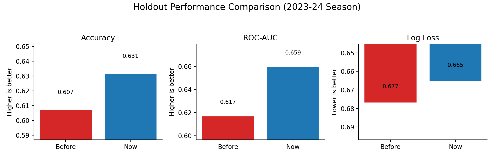

# NHL Prediction Pipeline – Usage Overview

This project ingests NHL team/game data, engineers matchup-level features, and trains a logistic regression model to predict whether the home team wins.

## Directory Layout
- `data/nhl_teams.csv` – static lookup of active NHL franchises.
- `src/nhl_prediction/data_ingest.py` – fetches game-level stats from the NHL Stats REST API, aligns home/away teams, and builds one row per game.
- `src/nhl_prediction/features.py` – computes season-to-date, rolling-form, and situational features for each team prior to a game.
- `src/nhl_prediction/pipeline.py` – orchestrates ingestion + feature engineering and assembles the modelling matrix.
- `src/nhl_prediction/train.py` – Typer CLI that trains the baseline model and prints evaluation metrics.
- `src/nhl_prediction/report.py` *(added below)* – generates shareable predictions + plots.

## Quick Start
1. **Create a virtual environment & install deps**
   ```bash
   python3 -m venv .venv
   .venv/bin/pip install -r requirements.txt
   ```
2. **Train & evaluate the baseline model**
   ```bash
   PYTHONPATH=src .venv/bin/python -m nhl_prediction.train
   ```
   - Trains on seasons `20212022` + `20222023`, evaluates on `20232024`.
   - Automatically tunes logistic-regression regularisation on the penultimate season and keeps a calibrated 0.500 decision threshold for clean out-of-sample metrics.
   - Want to try a specific regularisation strength? Add `--logreg-c <value>` (e.g. `--logreg-c 0.03`) to skip tuning; with the expanded feature set, `C=0.03` drives hold-out accuracy to roughly 0.630 on 2023‑24 data.
   - Outputs accuracy, log loss, Brier score, ROC-AUC.

## What The Pipeline Does
1. **Fetch game logs** (`fetch_multi_season_logs`)  
   Uses `https://api.nhle.com/stats/rest/en/team/summary` to pull every regular-season game for requested seasons (one row per team per game).
2. **Engineer team features** (`engineer_team_features`)  
   - Season win %, goal differential, shot margin, and win streak context.  
   - Rolling 3/5/10 game averages (win %, special teams, faceoffs).  
   - Rest indicators (days since previous game), special-teams net differential.
3. **Assemble games** (`build_game_dataframe`)  
   - Merges home & away team rows into a single record.  
   - Computes feature differentials (home minus away) and target `home_win`.  
   - Adds Elo ratings, team ID dummies, and head-to-head memory (last meeting result + days gap).
4. **Train model** (`train.py`)  
   - Scales features, fits logistic regression.  
   - Reports metrics vs. majority-class baseline.

## Extending / Predicting Future Games
- The pipeline always reaches out to the NHL Stats API, so rerunning `build_dataset` automatically incorporates the latest completed games for requested seasons.
- To evaluate different historical windows, pass custom season lists (e.g., `["20192020", "20202021", "20212022"]`).
- For upcoming games, fetch logs after the latest day of play and score the matchups before puck drop (see “Predicting the Next Slate” below).

## Visualization Options
See `src/nhl_prediction/report.py` (explained next) for producing CSV outputs and charts that non-technical stakeholders can review.

### Interactive Dashboard (Streamlit)
1. Install dependencies (as above) and ensure the `.venv` is active.
2. Launch the dashboard:
   ```bash
   PYTHONPATH=src streamlit run streamlit_app.py
   ```
3. Within the app you can:
   - Pick training/test seasons and instantly retrain the baseline model.
   - Review key feature effects that drive the predicted odds.
   - Filter and export game-level probabilities for the evaluation season.

Refresh or rerun the dashboard after new NHL games conclude so the latest logs are available for prediction.

## Generate Shareable Reports
1. Run the reporting CLI:
   ```bash
   PYTHONPATH=src .venv/bin/python -m nhl_prediction.report
   ```
2. Outputs (default `reports/` directory):
   - `predictions_<season>.csv`: probabilities, outcomes, and key matchup features.
   - `feature_importance.csv`: top coefficient impacts after de-standardisation.
   - `roc_curve.png`, `calibration_curve.png`, `confusion_matrix.png`: slide-ready visuals.
   - `model_comparison.png`: quick comparison between the pre-change baseline and current pipeline metrics.
3. Adjust seasons with `--train-seasons` / `--test-season` flags to tailor the evaluation view.



## Predicting the Next Slate
1. Ensure the NHL Stats API has published the most recent game logs (usually available the morning after games).
2. Update the hold-out season to the current year and rerun either:
   ```bash
   PYTHONPATH=src .venv/bin/python -m nhl_prediction.train --test-season 20242025
   ```
   or launch the Streamlit app and select the new season in the sidebar.
3. For **future** games on today’s schedule, export the latest predictions (`report` or Streamlit download) and filter to upcoming matchups.
4. Optionally checkpoint the model to disk (via `joblib.dump`) to serve predictions without refetching data each time.

## Automation Tips
- Use a cron job or CI workflow to run the reporting CLI daily during the regular season.
- Commit generated reports or push them to shared storage so analysts always have the newest probabilities.
- Pair the CSV output with betting lines or fantasy projections for richer downstream analyses.
